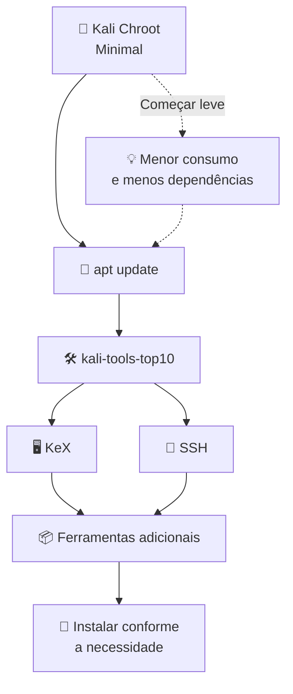

# Android + LineageOS + Magisk + Kali NetHunter - Guia Geral de Instalação e Compatibilidade

> Guia geral para adaptar a instalação de **LineageOS/ROM compatível + Magisk + Kali NetHunter + Kali Chroot Minimal** ao **seu aparelho Android**. O Xiaomi Mi 9 Lite (`pyxis`) aparece apenas como **estudo de caso validado**; arquivos, partições, recovery, imagens de boot, kernel e comandos de flash devem ser ajustados ao modelo real do leitor.
>
> **IMPORTANTE:** não copie comandos de flash de outro modelo. Antes de gravar qualquer partição, confirme o **modelo, codinome, esquema A/B, partições existentes, ROM, recovery, imagem de boot e kernel** do seu próprio aparelho. Um comando correto para um dispositivo pode inutilizar temporariamente outro.

---

## 1. Resultado final obtido

Ao final do procedimento, a configuração ficou aproximadamente assim:

- Xiaomi Mi 9 Lite
- Codinome: `pyxis`
- Bootloader desbloqueado
- Android 15
- LineageOS 22.2
- Magisk 30.7
- Root funcional
- Kali NetHunter instalado
- Kali Chroot **Minimal**
- Kali Linux Rolling
- `kali-tools-top10`
- NetHunter KeX
- SSH
- acesso SSH pelo computador via USB/ADB
- interface `mon0` criada no Wi-Fi interno
- limitação do chipset/driver Qualcomm para uso completo com Aircrack-ng
- recomendação de adaptador Wi-Fi USB externo para monitor mode/injection de forma adequada

---

# 2. Por que escolhemos o Kali Minimal

Um dos pontos mais importantes do procedimento foi **não instalar imediatamente uma imagem Kali muito grande**.

No NetHunter Chroot Manager escolhemos:

```text
Download Latest
Minimal
```

A ideia foi começar com a menor instalação funcional possível e depois adicionar somente os pacotes necessários.

Isso trouxe algumas vantagens:

1. menor espaço ocupado no armazenamento;
2. instalação mais rápida;
3. menor chance de erro durante a criação do chroot;
4. menos pacotes para atualizar;
5. menor consumo de memória e armazenamento;
6. mais facilidade para identificar problemas;
7. possibilidade de instalar as ferramentas de segurança gradualmente.

### O que evitamos logo após a instalação

Não executamos imediatamente:

```bash
apt full-upgrade
```

nem:

```bash
apt dist-upgrade
```

Também evitamos instalar de início:

```bash
kali-linux-full
```

ou:

```bash
kali-linux-everything
```

Esses metapacotes podem instalar uma quantidade muito grande de ferramentas, bibliotecas e dependências.

A abordagem utilizada foi:



---

# 3. Ambiente de referência e dados do seu aparelho

## Seu aparelho

Antes de baixar qualquer arquivo, identifique o seu dispositivo e preencha:

```text
Fabricante:
Modelo:
Codinome:
Arquitetura:
Versão do Android:
ROM/build:
Kernel:
Bootloader desbloqueável:
Esquema A/B:
Partições de boot existentes:
Recovery suportado:
USB OTG:
Suporte NetHunter/kernel:
```

Com ADB, alguns dados podem ser obtidos com:

```bash
adb shell getprop ro.product.manufacturer
adb shell getprop ro.product.model
adb shell getprop ro.product.device
adb shell getprop ro.product.cpu.abi
adb shell getprop ro.build.version.release
adb shell uname -a
```

### Estudo de caso validado neste projeto

```text
Aparelho: Xiaomi Mi 9 Lite
Codinome: pyxis
```

Sempre que o guia citar `pyxis`, `recovery.img`, `boot.img` ou uma build específica do LineageOS, trate esses valores como **exemplos do aparelho validado**, e não como arquivos universais.

## Computador

```text
Windows 11
ADB
Fastboot
```

## Software utilizado

- LineageOS 22.2
- Android 15
- Magisk 30.7
- Kali NetHunter
- Kali Linux Rolling

## Arquivos utilizados

Os nomes abaixo são do **estudo de caso Mi 9 Lite**. No seu aparelho, substitua cada arquivo pela versão explicitamente destinada ao seu modelo/codinome:

```text
lineage-22.2-20260616-nightly-pyxis-signed.zip
recovery.img
boot.img
Magisk-v30.7.apk
NetHunter.apk
```

O arquivo:

```text
boot.img
```

deve corresponder **exatamente à versão/build da ROM instalada no seu aparelho**. Em alguns dispositivos modernos o Magisk pode exigir `init_boot.img` em vez de `boot.img`; outros ainda usam `vendor_boot`. Consulte a documentação específica do seu modelo antes de fazer flash.

---

# 3.1. Compatibilidade: não existe um procedimento de flash universal

O fluxo conceitual é semelhante entre aparelhos, mas a implementação varia muito.

Antes de seguir o tutorial, verifique:

| Item | Por que importa |
|---|---|
| Modelo e codinome | ROMs e kernels são construídos para dispositivos específicos |
| Bootloader | Alguns fabricantes dificultam ou impedem o desbloqueio |
| A/B ou A-only | Altera a forma como boot, recovery e atualizações são tratados |
| `boot` / `init_boot` / `vendor_boot` | O local que deve ser corrigido pelo Magisk varia |
| Recovery | Nem todo aparelho possui uma partição `recovery` dedicada |
| Android/ROM/build | A imagem corrigida deve corresponder à build instalada |
| Kernel | Recursos avançados do NetHunter dependem dele |
| Wi-Fi interno | Monitor mode e injection dependem de chipset + driver + kernel |
| USB OTG | Necessário para muitos adaptadores externos |
| Arquitetura | Normalmente ARM64 em aparelhos atuais, mas deve ser confirmada |

## Níveis práticos de compatibilidade com NetHunter

### Nível 1 - dispositivo oficialmente suportado

Há imagem/kernel e instruções específicas do projeto NetHunter para aquele modelo. É o cenário preferível para recursos avançados.

### Nível 2 - suporte comunitário/kernel específico

O NetHunter pode funcionar muito bem, mas ROM, Android, kernel e versão do aparelho precisam coincidir com o projeto comunitário utilizado.

### Nível 3 - ambiente genérico/root/chroot

É possível executar grande parte do Kali e suas ferramentas, mas funcionalidades dependentes de kernel ou hardware - Wi-Fi monitor/injection, HID, determinados dispositivos USB etc. - podem não estar disponíveis.

> **Kali funcionando não significa NetHunter com todos os recursos de hardware funcionando.**

## Atenção especial a aparelhos A/B e Androids recentes

Não presuma que existe uma partição chamada `recovery`.

Dependendo do aparelho, você poderá encontrar:

```text
boot
boot_a / boot_b
init_boot
vendor_boot
recovery
```

Por isso, comandos como:

```bash
fastboot flash recovery recovery.img
fastboot flash boot magisk_patched.img
```

são **exemplos**, não comandos universais.

Primeiro descubra o esquema de partições e siga a documentação da ROM, do Magisk e do dispositivo.

---

# 4. Pré-requisitos

Antes de começar:

- faça backup dos arquivos do celular;
- carregue a bateria;
- utilize um cabo USB confiável;
- tenha ADB e Fastboot funcionando;
- deixe todos os arquivos necessários em uma pasta no PC;
- confirme que o aparelho é realmente o `pyxis`;
- confirme que o bootloader está desbloqueado.

Uma estrutura simples no computador pode ser:

```text
C:\xiaomi-kali\
├── adb.exe
├── fastboot.exe
├── recovery.img
├── boot.img
├── lineage-22.2-20260616-nightly-pyxis-signed.zip
├── Magisk-v30.7.apk
└── NetHunter.apk
```

Abra o Prompt de Comando ou PowerShell nessa pasta.

---

# 5. Verificar a comunicação ADB

Com o Android iniciado e a depuração USB habilitada:

```bash
adb devices
```

Resultado esperado:

```text
List of devices attached
fb0ee349    device
```

O identificador será diferente em cada aparelho.

Caso apareça:

```text
unauthorized
```

desbloqueie a tela do celular e aceite a autorização de depuração USB.

Execute novamente:

```bash
adb devices
```

---

# 6. Entrar no Fastboot

Execute:

```bash
adb reboot bootloader
```

O celular reiniciará para o modo Fastboot.

Confirme a comunicação:

```bash
fastboot devices
```

Exemplo:

```text
fb0ee349    fastboot
```

---

# 7. Confirmar o bootloader desbloqueado e a compatibilidade do seu modelo

Utilizamos:

```bash
fastboot getvar unlocked
```

O resultado esperado era equivalente a:

```text
unlocked: yes
```

Se estiver bloqueado, **não prossiga com o flash das imagens**.

---

# 8. Inicializar o recovery compatível com o seu aparelho

**Não execute os comandos abaixo até confirmar que eles são apropriados ao seu aparelho.**

No dispositivo de referência, primeiro preferimos testar o recovery temporariamente:

```bash
fastboot boot recovery.img
```

Isso permite inicializar o recovery sem necessariamente gravá-lo imediatamente.

Somente quando a documentação específica do aparelho indicar uma partição `recovery`, poderá existir um fluxo semelhante a:

```bash
fastboot flash recovery recovery.img
```

> A forma de gravação do recovery pode variar de acordo com a ROM, versão do firmware e esquema de partições. No procedimento utilizado, o `recovery.img` era compatível com o `pyxis`.

---

# 9. Fazer Factory Reset, se exigido pela ROM do seu aparelho

Dentro do Lineage Recovery, realize o apagamento necessário antes da instalação limpa.

No menu do recovery:

```text
Factory reset
```

Confirme o procedimento.

Isso apaga os dados do aparelho.

---

# 10. Preparar o ADB Sideload

No Lineage Recovery escolha:

```text
Apply update
    ↓
Apply from ADB
```

O celular ficará aguardando o pacote pelo computador.

---

# 11. Instalar a ROM compatível por ADB Sideload

No PC execute:

```bash
adb sideload lineage-22.2-20260616-nightly-pyxis-signed.zip
```

Aguarde a transferência e instalação.

O arquivo que utilizamos foi:

```text
lineage-22.2-20260616-nightly-pyxis-signed.zip
```

Ao terminar, reinicie o aparelho.

---

# 12. Primeiro boot da ROM instalada

O primeiro boot pode ser mais demorado que uma inicialização normal.

Faça a configuração inicial do Android.

Depois confira:

```text
Configurações
    ↓
Sobre o telefone / Sobre o dispositivo
```

No nosso aparelho verificamos:

```text
Modelo: Mi 9 Lite
Android: 15
LineageOS: 22.2-20260616-NIGHTLY-pyxis
```

Esse passo é importante para confirmar que o sistema iniciou corretamente **antes de adicionar o root**.

---

# 13. Ativar as opções do desenvolvedor

No Android:

```text
Configurações
    ↓
Sobre o telefone
    ↓
Número da versão / Build number
```

Toque aproximadamente **7 vezes** até o Android informar que as opções do desenvolvedor foram habilitadas.

Depois acesse as opções do desenvolvedor e habilite:

```text
Depuração USB
```

Quando aplicável, também habilite:

```text
USB debugging (Security settings)
```

Reconecte o aparelho ao computador.

Teste:

```bash
adb devices
```

---

# 14. Instalar o Magisk

Instale o APK:

```bash
adb install Magisk-v30.7.apk
```

Abra o Magisk no celular.

No nosso procedimento a versão utilizada foi:

```text
Magisk 30.7
```

---

# 15. Obter e copiar a imagem de boot correta do seu aparelho

No aparelho de referência, o root foi realizado corrigindo o `boot.img` da ROM instalada.

**No seu aparelho**, descubra primeiro qual imagem o Magisk deve corrigir. Dependendo do dispositivo/Android, pode ser `boot.img` ou `init_boot.img`. Não escolha por tentativa e erro.

Copie o arquivo:

```bash
adb push boot.img /sdcard/Download/
```

Confirme que ele aparece na pasta:

```text
Download
```

do aparelho.

> **Muito importante:** o `boot.img` precisa ser da mesma build do LineageOS instalada. Misturar versões pode causar bootloop.

---

# 16. Corrigir a imagem de boot apropriada usando o Magisk

Abra:

```text
Magisk
```

Escolha:

```text
Instalar
    ↓
Selecionar e corrigir um arquivo
```

Selecione:

```text
Download/boot.img
```

O Magisk processará a imagem.

Ao terminar será criado um arquivo semelhante a:

```text
magisk_patched-30700_xxxxx.img
```

normalmente na pasta:

```text
/sdcard/Download/
```

---

# 17. Copiar o boot corrigido para o computador

Para facilitar o flash, copie a imagem corrigida para o PC:

```bash
adb pull /sdcard/Download/magisk_patched-30700_xxxxx.img
```

Substitua o nome pelo arquivo realmente criado pelo Magisk.

Confirme que o arquivo está na pasta de trabalho do computador.

---

# 18. Reiniciar novamente em Fastboot

Execute:

```bash
adb reboot bootloader
```

Confira:

```bash
fastboot devices
```

---

# 19. Gravar a imagem corrigida pelo Magisk - somente após confirmar a partição correta

Execute:

```bash
fastboot flash boot magisk_patched-30700_xxxxx.img
```

Depois:

```bash
fastboot reboot
```

O Android deverá iniciar normalmente.

---

# 20. Confirmar o Magisk

Abra o Magisk.

No procedimento concluído observamos:

```text
Magisk
Instalado: 30.7 (30700)
Ramdisk: Sim
```

Agora teste o root pelo computador:

```bash
adb shell su -c id
```

Na primeira utilização o Magisk pode solicitar autorização de superusuário no celular.

Aceite.

Resultado esperado:

```text
uid=0(root) gid=0(root)
```

Isso confirma que o root está funcionando.

---

# 21. Instalar o Kali NetHunter

Instale o aplicativo:

```bash
adb install NetHunter.apk
```

Abra o NetHunter.

Conceda:

- permissões solicitadas pelo Android;
- acesso a arquivos, quando necessário;
- autorização de root através do Magisk.

O NetHunter atuará como a interface de gerenciamento do ambiente Kali.

---

# 22. Instalar o Kali Chroot

No NetHunter acesse:

```text
Kali Chroot Manager
```

Escolha:

```text
Install
```

Depois:

```text
Download Latest
```

E, de forma intencional, escolhemos:

```text
Minimal
```

## Por que Minimal?

Nesse aparelho preferimos **não começar pela imagem Full**.

O objetivo era primeiro validar:

```text
Android
  ↓
Root
  ↓
NetHunter
  ↓
Chroot
  ↓
Rede
  ↓
APT
```

Somente depois instalar as ferramentas.

Essa estratégia reduz bastante a quantidade de variáveis em caso de erro.

Aguarde a criação e extração do chroot.

Não interrompa a instalação.

---

# 23. Iniciar o Kali Chroot

Após a instalação:

```text
NetHunter
    ↓
Kali Chroot Manager
    ↓
Start
```

Abra o terminal Kali/NetHunter.

Teste:

```bash
whoami
```

Resultado:

```text
root
```

Depois:

```bash
cat /etc/os-release
```

No ambiente utilizado obtivemos Kali Linux Rolling.

Exemplo:

```text
PRETTY_NAME="Kali GNU/Linux Rolling"
```

---

# 24. Testar a conectividade antes de atualizar

Antes de instalar centenas de pacotes, confirme a rede:

```bash
ip addr
```

Teste resolução DNS:

```bash
ping -c 4 kali.org
```

Opcionalmente:

```bash
ping -c 4 8.8.8.8
```

Se IP funcionar e nome não funcionar, investigue DNS antes de prosseguir.

---

# 25. Atualizar apenas os índices dos repositórios

O primeiro comando utilizado foi:

```bash
apt update
```

O esperado é acessar o repositório `kali-rolling` e finalizar com algo semelhante a:

```text
Reading package lists... Done
```

Nesta fase **não fizemos imediatamente um upgrade massivo do sistema**.

---

# 26. Verificar problemas do dpkg

Uma verificação útil:

```bash
dpkg --audit
```

Se não houver saída, em geral não há pacotes parcialmente configurados detectados pelo `dpkg --audit`.

Também pode ser útil:

```bash
apt --fix-broken install
```

mas somente quando houver uma dependência quebrada a corrigir.

---

# 27. Instalar um conjunto controlado de ferramentas

Em vez de:

```bash
apt install kali-linux-full
```

ou:

```bash
apt install kali-linux-everything
```

optamos por um conjunto menor:

```bash
apt install kali-tools-top10 -y
```

Esse metapacote fornece um conjunto inicial de ferramentas comuns do Kali sem transformar imediatamente o celular em uma instalação gigantesca.

Entre as ferramentas normalmente associadas a esse conjunto estão utilitários como:

- Nmap
- Metasploit Framework
- Burp Suite
- Wireshark
- Aircrack-ng
- John the Ripper
- Hydra
- SQLmap
- Nikto
- Gobuster

O conteúdo exato do metapacote pode mudar com a versão do Kali.

---

# 28. Filosofia usada para adicionar ferramentas

Depois do `kali-tools-top10`, a recomendação foi instalar ferramentas conforme a necessidade.

Por exemplo:

```bash
apt install nmap
```

ou:

```bash
apt install tcpdump
```

ou outro pacote específico.

Isso é preferível a adicionar milhares de pacotes sem necessidade.

---

# 29. Instalar o ambiente gráfico KeX

Para ter interface gráfica do Kali, utilizamos o KeX.

No chroot:

```bash
apt install kali-win-kex
```

Depois:

```bash
kex
```

Para verificar o estado:

```bash
kex --status
```

No Android também é necessário o aplicativo:

```text
NetHunter KeX
```

disponível no ecossistema NetHunter.

---

# 30. Configurar SSH no Kali

Verifique os pacotes SSH:

```bash
dpkg -l | grep openssh
```

Esperávamos encontrar componentes como:

```text
openssh-client
openssh-server
openssh-sftp-server
```

Se necessário:

```bash
apt install openssh-server -y
```

Gere as chaves de host:

```bash
ssh-keygen -A
```

---

# 31. Iniciar o servidor SSH

No ambiente Kali:

```bash
/usr/sbin/sshd
```

Verifique se a porta 22 está escutando:

```bash
ss -tlnp | grep :22
```

Exemplo esperado:

```text
LISTEN 0 128 0.0.0.0:22 0.0.0.0:*
```

---

# 32. Acessar o Kali por SSH através do USB

Uma solução prática foi encaminhar uma porta do computador para a porta 22 do celular usando ADB.

No PC:

```bash
adb forward tcp:2222 tcp:22
```

Depois:

```bash
ssh root@127.0.0.1 -p 2222
```

Isso permite trabalhar no terminal Kali pelo teclado do computador sem depender de uma conexão SSH pela rede Wi-Fi.

---

# 33. Inspecionar as interfaces Wi-Fi

Dentro do Kali:

```bash
iw dev
```

Também utilizamos:

```bash
iw list
```

e:

```bash
ip addr
```

Esses comandos ajudam a identificar:

- interfaces Wi-Fi;
- PHYs disponíveis;
- tipos de interface suportados;
- capacidades declaradas pelo driver.

---

# 34. Criar uma interface de monitoramento

No teste realizado com o hardware interno, foi possível tentar criar uma interface adicional de tipo monitor.

O fluxo utilizado foi semelhante a:

```bash
iw phy phy0 interface add mon0 type monitor
```

Depois:

```bash
ip link set mon0 up
```

Confira:

```bash
iw dev
```

No teste apareceu uma interface:

```text
Interface mon0
    type monitor
```

---

# 35. Verificar as limitações do Wi-Fi interno do seu aparelho

Esse foi um ponto importante do teste.

Embora o driver Qualcomm (`icnss`) permitisse a criação de uma interface chamada `mon0`, isso **não significava compatibilidade completa com o conjunto de funcionalidades exigidas pelo Aircrack-ng**.

Ao tentar utilizar:

```bash
airodump-ng mon0
```

observamos erros equivalentes a:

```text
ioctl(SIOCSIWMODE) failed:
Invalid argument
```

e:

```text
Error setting channel:
Operation not supported (-95)
```

## Conclusão

No estudo de caso, o Wi-Fi interno do Xiaomi Mi 9 Lite não se mostrou uma solução confiável para monitor mode/injection apenas porque a interface `mon0` pode ser criada.

O problema está relacionado ao suporte do kernel/driver/chipset às operações necessárias.

---

# 36. Quando necessário, usar adaptador Wi-Fi USB compatível

Para atividades de laboratório que dependam de monitor mode e recursos compatíveis com Aircrack-ng, a alternativa recomendada foi usar um **adaptador Wi-Fi USB externo compatível** através de OTG.

Modelos/chipsets mencionados no nosso teste/guia:

```text
ALFA AWUS036NHA
Chipset: Atheros AR9271
```

```text
TP-Link TL-WN722N v1
Chipset: Atheros AR9271
```

```text
ALFA AWUS036ACH
Chipset: RTL8812AU
```

> No caso do TL-WN722N, a revisão de hardware é importante. As versões posteriores não usam necessariamente o mesmo chipset da v1.

Com um adaptador reconhecido como, por exemplo, `wlan1`:

```bash
airmon-ng start wlan1
```

e a interface de monitor correspondente poderá aparecer como:

```text
wlan1mon
```

Para inspecionar redes em ambiente autorizado de laboratório:

```bash
airodump-ng wlan1mon
```

Use esses recursos somente em redes e equipamentos próprios ou com autorização expressa.

---

# 37. Comandos de diagnóstico que ficaram úteis

## Android / ADB

```bash
adb devices
adb shell
adb reboot bootloader
adb push
adb pull
adb forward
```

## Fastboot

```bash
fastboot devices
fastboot getvar unlocked
fastboot boot recovery.img
fastboot flash recovery recovery.img
fastboot flash boot magisk_patched-30700_xxxxx.img
fastboot reboot
```

## Kali

```bash
whoami
cat /etc/os-release
apt update
dpkg --audit
ip addr
iw dev
iw list
ss -tlnp
kex --status
```

---

# 38. Checklist de validação

Antes de avançar de uma etapa para outra, usamos essencialmente esta sequência de validação:

- [ ] ADB reconhece o aparelho
- [ ] Fastboot reconhece o aparelho
- [ ] bootloader aparece desbloqueado
- [ ] Lineage Recovery inicializa
- [ ] LineageOS instala por sideload
- [ ] Android inicia normalmente
- [ ] LineageOS/Android mostram a versão esperada
- [ ] depuração USB habilitada
- [ ] Magisk instalado
- [ ] `boot.img` correto copiado para o aparelho
- [ ] Magisk gera `magisk_patched`
- [ ] Fastboot grava o boot corrigido
- [ ] Android continua inicializando
- [ ] `adb shell su -c id` retorna root
- [ ] NetHunter instalado
- [ ] permissão root concedida ao NetHunter
- [ ] Kali Chroot **Minimal** instalado
- [ ] Chroot inicia
- [ ] `whoami` retorna `root`
- [ ] `apt update` funciona
- [ ] `kali-tools-top10` instalado
- [ ] KeX funcional
- [ ] SSH funcional
- [ ] ADB forwarding para SSH funcional
- [ ] interfaces Wi-Fi identificadas
- [ ] limitação do Wi-Fi interno documentada
- [ ] adaptador USB externo utilizado quando necessário

---

# 39. Resumo do fluxo completo

```text
Xiaomi Mi 9 Lite (pyxis)
        │
        ▼
Bootloader desbloqueado
        │
        ▼
Lineage Recovery
        │
        ▼
Factory Reset
        │
        ▼
ADB Sideload
        │
        ▼
LineageOS 22.2 / Android 15
        │
        ▼
Magisk 30.7
        │
        ▼
Patch do boot.img
        │
        ▼
Flash magisk_patched.img
        │
        ▼
Root confirmado
        │
        ▼
Kali NetHunter
        │
        ▼
Kali Chroot Manager
        │
        ▼
Download Latest
        │
        ▼
MINIMAL
        │
        ▼
apt update
        │
        ▼
kali-tools-top10
        │
        ├──────────► KeX
        │
        ├──────────► SSH
        │
        └──────────► Ferramentas adicionais sob demanda
                           │
                           ▼
                Testes de Wi-Fi
                           │
             ┌─────────────┴─────────────┐
             ▼                           ▼
        Wi-Fi interno             Adaptador USB
        Qualcomm                  compatível
             │                           │
       mon0 criado                 Monitor mode
       mas limitado                mais adequado
```

---

# 40. Cuidados importantes

## Não misturar arquivos de builds diferentes

O ponto mais perigoso no root é usar:

```text
boot.img
```

de uma versão diferente da ROM instalada.

O `boot.img` deve corresponder à build efetivamente instalada.

## Manter uma cópia do boot original

Guarde:

```text
boot.img
```

original em local seguro.

Isso facilita a recuperação caso o boot corrigido pelo Magisk cause problemas.

## Validar cada camada separadamente

Não instale tudo de uma vez.

A sequência utilizada foi deliberadamente:

```text
LineageOS funciona?
        ↓
Sim
        ↓
Magisk funciona?
        ↓
Sim
        ↓
NetHunter funciona?
        ↓
Sim
        ↓
Chroot Minimal funciona?
        ↓
Sim
        ↓
APT funciona?
        ↓
Sim
        ↓
Adicionar ferramentas
```

Essa abordagem torna muito mais simples descobrir em qual etapa surgiu um problema.

---

# 41. Estratégia recomendada de atualização

Logo após uma instalação funcional:

```bash
apt update
```

Depois verifique o estado do sistema.

Evite fazer imediatamente uma mudança gigantesca no ambiente.

Prefira:

```bash
apt install <pacote-necessário>
```

e vá construindo o ambiente gradualmente.

Antes de grandes alterações, se o NetHunter utilizado oferecer um mecanismo viável de backup do chroot, faça uma cópia.

---

# 42. Arquitetura final do ambiente

Ao final, o objetivo alcançado foi transformar o Xiaomi Mi 9 Lite em uma plataforma portátil de laboratório:

```text
Android / LineageOS
        +
Magisk Root
        +
NetHunter
        +
Kali Linux Chroot Minimal
        +
Ferramentas selecionadas
        +
KeX
        +
SSH
        +
ADB
        +
Wi-Fi USB externo quando necessário
```

Isso preserva o Android como sistema principal e executa o Kali em um chroot controlado pelo NetHunter.

---

# 43. Observação sobre NetHunter e o kernel

Instalar o aplicativo NetHunter e o Kali Chroot não transforma automaticamente o kernel Android em um kernel NetHunter com todos os patches possíveis.

Recursos de baixo nível dependem de:

- kernel;
- módulos;
- drivers;
- chipset;
- USB OTG;
- suporte do dispositivo.

Isso explica por que o ambiente Kali funcionava normalmente enquanto determinadas operações Wi-Fi do hardware interno continuavam limitadas.

---

# 44. Regra prática recomendada para qualquer aparelho

A filosofia que utilizamos pode ser resumida em:

> **Começar mínimo, validar tudo e expandir aos poucos.**

Em vez de tentar instalar o máximo possível:

```text
Minimal
  +
Top10
  +
ferramentas específicas
```

é uma solução mais segura e previsível para adaptar o NetHunter a diferentes aparelhos.

---

## Referência rápida

### Root

```bash
adb push boot.img /sdcard/Download/
adb pull /sdcard/Download/magisk_patched-30700_xxxxx.img
adb reboot bootloader
fastboot flash boot magisk_patched-30700_xxxxx.img
fastboot reboot
adb shell su -c id
```

### Chroot

```text
NetHunter
→ Kali Chroot Manager
→ Install
→ Download Latest
→ Minimal
→ Start
```

### Kali

```bash
whoami
cat /etc/os-release
apt update
dpkg --audit
apt install kali-tools-top10 -y
```

### KeX

```bash
apt install kali-win-kex
kex
kex --status
```

### SSH

```bash
ssh-keygen -A
/usr/sbin/sshd
ss -tlnp | grep :22
```

No PC:

```bash
adb forward tcp:2222 tcp:22
ssh root@127.0.0.1 -p 2222
```

### Wi-Fi

```bash
iw dev
iw list
ip addr
```

Teste da interface interna:

```bash
iw phy phy0 interface add mon0 type monitor
ip link set mon0 up
iw dev
```

Para adaptador USB compatível:

```bash
airmon-ng start wlan1
airodump-ng wlan1mon
```

---

**Dispositivo:** Xiaomi Mi 9 Lite (`pyxis`)  
**Sistema utilizado:** LineageOS 22.2 / Android 15  
**Root:** Magisk 30.7  
**Ambiente Kali:** NetHunter + Kali Chroot Minimal  


---

# 45. Como adaptar e contribuir com outro aparelho

Ao testar este procedimento em outro dispositivo, documente pelo menos:

```text
Fabricante:
Modelo:
Codinome:
SoC:
Arquitetura:
Android:
ROM/build:
Recovery:
A/B ou A-only:
Imagem corrigida pelo Magisk: boot / init_boot / outra
Versão Magisk:
Versão NetHunter:
Kali Chroot: Minimal / outra
Kernel:
KeX:
SSH:
USB OTG:
Wi-Fi interno:
Monitor mode:
Injection:
Adaptador Wi-Fi USB testado:
Observações:
```

## Matriz de compatibilidade sugerida

| Aparelho | Codinome | ROM/Android | Root | Chroot Minimal | KeX | Wi-Fi interno | USB Wi-Fi |
|---|---|---|---|---|---|---|---|
| Xiaomi Mi 9 Lite | `pyxis` | LineageOS 22.2 / Android 15 | ✅ | ✅ | ✅ | ⚠️ limitado no teste | ✅ recomendado |
| Seu aparelho | - | - | - | - | - | - | - |

Ao abrir uma Issue ou Pull Request, informe as versões exatas e diferencie claramente:

- o que foi **testado e confirmado**;
- o que é apenas **esperado/documentado**;
- o que **não funciona**;
- e qualquer comando específico daquele modelo.

Isso ajuda a transformar o repositório em uma referência multi-dispositivo sem induzir outros usuários a executar flashes incompatíveis.
